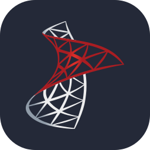

# Hi 👋, I'm WaFF

Aspiring DevOps engineer from Minsk, first-year student at BNTU.
Learning DevOps in public since November 2025 and looking for an internship.

- currently: Kubernetes and Linux troubleshooting on [SadServers](https://sadservers.com/)
- worked with: Docker, GitHub Actions, GitLab CI, Ansible, Prometheus, Grafana, Helm
- learning log: [devops](https://github.com/IsWaFF/devops), weekly notes and labs
- projects: [iswaff.com](https://iswaff.com/)
- contact: [Telegram](https://t.me/swawson)

<h3 align="left">Languages and Tools:</h3>

  
  
  
  
  
  
  
  
  
  
  
  
  
  
  
  
  
  
  
  
  
  
  

 
### Stats

 
 

